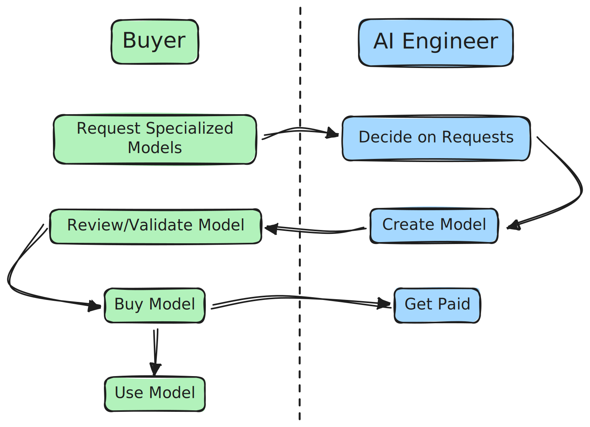

> Hello human. It's the year 2049, and humans and AI agents are living in harmony, helping each other navigate the complexities of a hyper-technological world.
>
> Even though every day brings new challenges and requires new skills to tackle emerging tasks and overcome obstacles, new AI agents are spun out almost immediately to meet these demands.
>
> Thanks to the Replicant Network, humans and AI agents can collaborate seamlessly, commission new AI models, and fund their development—whether individually or collectively. Meanwhile, in the shadows of the cyberpunk world, some push the boundaries to create the ultimate AI model, shaped by demand and necessity.

## About Replicant Network

Creating AI models is a challenging endeavor, whether starting from scratch or fine-tuning existing ones. It demands technical expertise, deep domain knowledge, and a significant investment of time and resources to achieve high-quality results. As artificial intelligence becomes increasingly embedded in our daily lives and AI agents continue to transform the internet landscape, access to specialized models will be crucial for individuals and organizations alike.

**Replicant Network** is a platform designed to democratize access to AI models through innovative crowdfunding and private bounty mechanisms. Here’s how it works:

- **Request Your Model**: Users can specify the type of AI model they need for their projects, whether for work, personal use, or entertainment.

- **Fund or Incentivize Creation**: By contributing funds or setting bounties, users incentivize developers and experts to create the desired model.

- **Earn Rewards**: Participants who support model creation—whether through funding or development—are rewarded with shared revenue streams generated by the model's usage.

At Replicant Network, we believe that everyone should have access to the AI tools they need while actively contributing to the growing AI economy. Whether you're an individual seeking a custom solution or an organization aiming to scale your operations with domain-specific models, Replicant Network provides a collaborative ecosystem for innovation.

<CardGroup cols={2}>
  <Card
    title="Quickstart"
    icon="rocket"
    href="/get-started/quickstart"
  >
    Get your desired AI model in just a few simple steps
  </Card>
  <Card
    title="Bounties"
    icon="hand-fist"
    href="/platform/bounties"
  >
    Learn how you can crowdfund the model you need
  </Card>
  <Card
    title="Use AI Models"
    icon="think-peaks"
    href="/platform/use-ai-models"
  >
    Learn how to use the AI models created by the Replicant Network
  </Card>
  <Card
    title="Pricing"
    icon="dollar-sign"
    href="/platform/pricing"
  >
    Learn about the pricing of the Replicant Network
  </Card>
</CardGroup>
