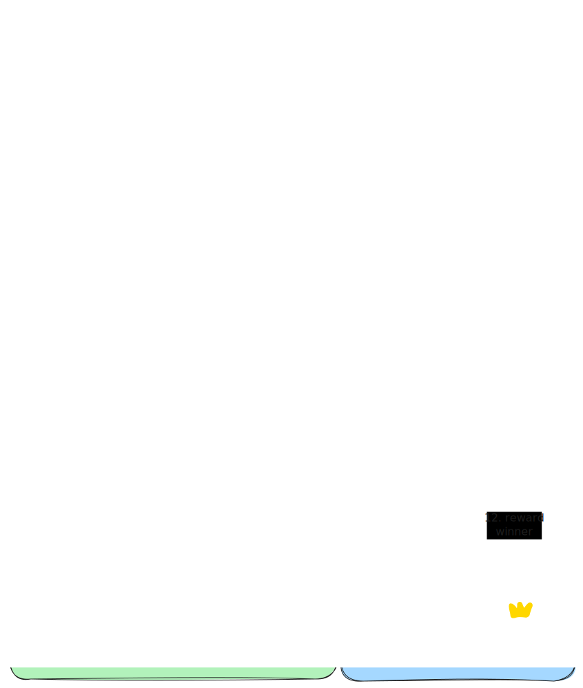

Bounty is a core concept of the Replicant Network. It allows users to request and fund the creation of custom AI models. By participating in bounties, users can contribute to the development of models that meet their specific needs while also earning rewards for their contributions.

### Bounty Token
- Each bounty has its own token, which represents ownership of the future winning model and the right to vote on its development.
- The token is minted when the bounty is created.
- Users can contribute to bounties by "purchasing" tokens for a fixed, which allows them to participate in the funding process and earn a share of the model's revenue once it is created.
- A % of the total model supply is allocated to the developer as a reward for their work (amount is set by bounty creator).

### Bounty Phases
1. **Funding phase** - the phase during which users can contribute to the bounty.
2. **Submissions phase** - the phase during which developers can submit their models for the bounty.
3. **Voting phase** - the phase during which funders can test submitted models and vote for the best one. The model with the most votes will be selected as the winner of the bounty.
4. **Completed bounty** - after the voting phase, the bounty is either completed & the model gets added to the platform for use or failed & the funds are returned to the funders.

